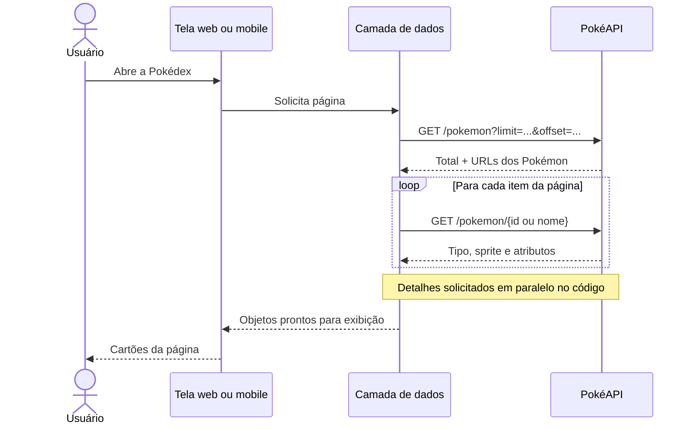

# PokéAPI: como a aplicação consulta os dados

## Explicação para apresentação

A aplicação não mantém uma base própria de Pokémon. Ela faz requisições HTTP `GET` à PokéAPI, que responde em JSON. A interface chama uma função de acesso a dados; essa função busca a resposta, transforma os campos necessários e entrega um objeto que a tela consegue mostrar. Os módulos de companheiro e perfil guardam o progresso localmente: a PokéAPI fornece os dados da espécie, mas não recebe os cuidados nem os dados do treinador.

## As chamadas principais

| Situação | Requisição | Resultado usado na tela |
| --- | --- | --- |
| Abrir ou trocar a página da lista | `GET https://pokeapi.co/api/v2/pokemon?limit=12&offset=0` na web; `limit=20` no mobile | Total de Pokémon e endereços dos itens da página |
| Completar os cartões da lista | `GET` para cada `results[].url` retornada pela lista | Nome, número, tipos e imagem de cada Pokémon |
| Buscar por nome ou número | `GET https://pokeapi.co/api/v2/pokemon/pikachu` ou `/25` | Dados de um Pokémon específico |
| Abrir uma ficha no mobile | `GET https://pokeapi.co/api/v2/pokemon/25` | Detalhes atualizados para a tela individual |

O `offset` define quantos itens são pulados. Na primeira página ele é `0`; na segunda, `12` na web ou `20` no mobile. A resposta da listagem contém basicamente nomes e URLs, por isso o projeto faz as consultas individuais dos itens da página em paralelo para obter tipos e imagens.

## Onde isso acontece no código

**Web:** `src/App.tsx` controla página e texto digitado. Após 300 ms sem digitar, `src/hooks/usePokeApi.ts` usa `fetchList` para a página ou `fetchByQuery` para um nome/número. O hook faz `fetch`, lê o JSON, mapeia tipos, atributos, habilidades e sprites e guarda resultado, carregamento e erro em estados React. Quando a página ou busca muda rapidamente, `AbortController` cancela a requisição anterior.

**Mobile:** `mobile/src/screens/pokedex-screen.tsx` usa React Query. A consulta da página chama `listPokemon` e a pesquisa chama `getPokemon`, ambas definidas em `mobile/src/api/pokeApi.ts`. O termo também espera 300 ms. React Query separa as consultas por `queryKey`, reutiliza dados recentes por até cinco minutos antes de considerá-los desatualizados e recebe um sinal para cancelar chamadas obsoletas. A rota `mobile/src/app/pokemon/[id].tsx` chama `getPokemon` novamente ao abrir a ficha e valida o tipo recebido antes de escolher o tema visual.

No mobile, `pokeApi.ts` valida o formato do JSON antes de transformá-lo nos tipos internos `PokemonSummary` e `PokemonDetail`. Se houver falha de rede, HTTP 404 ou resposta inválida, a tela mostra uma mensagem e pode oferecer nova tentativa. Na web, o hook também diferencia Pokémon não encontrado de falha na consulta.

## Relação com o companheiro

Na ficha, o usuário pode selecionar o Pokémon como companheiro. A interface aproveita o número e o nome da espécie já consultada. Daí em diante, alimentar, brincar, passear e salvar o perfil são operações locais feitas pelas regras em `shared/`; elas não enviam requisições à PokéAPI. As imagens dos Pokémon usam URLs de sprites ou artes hospedadas no repositório de sprites da PokéAPI e podem depender de conexão ou cache.

## Resumo em uma frase

**A PokéAPI fornece informações dos Pokémon por `GET`; web e mobile transformam o JSON em dados de tela, enquanto o relacionamento e o perfil são calculados e salvos localmente.**

Para a visão geral do projeto, consulte [Visão geral](visao-geral.md).
