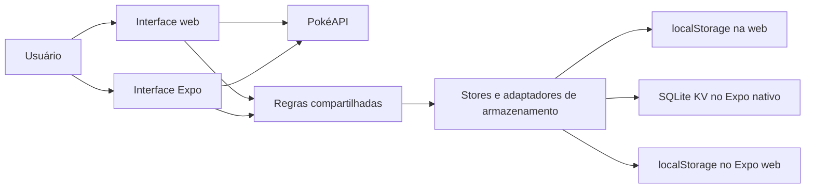

# Visão geral do projeto para apresentação

## Explicação rápida

Esta Pokédex permite consultar Pokémon por página, nome ou número e ver detalhes como tipos, atributos e habilidades. A consulta usa a PokéAPI. Há duas interfaces: uma aplicação web em React, TypeScript e Vite e um aplicativo em React Native com Expo. As duas oferecem Pokédex, companheiro e perfil do treinador. A web tem um fundo animado em Three.js; as interfaces têm temas Gengar e Mewtwo e tratamento para carregamento e erros.

No módulo de companheiro, o usuário escolhe um Pokémon, dá um apelido e cuida dele com frutas, carinho, brincadeiras, descanso, passeios, higiene e truques. Cada interação altera atributos como alegria, energia e saciedade; algumas aumentam o vínculo. O progresso individual, o estoque compartilhado de frutas e o histórico são salvos localmente. O perfil do treinador permite editar nome, avatar, região e apresentação, além de mostrar estatísticas e conquistas obtidas com os cuidados.

O ponto central da implementação é que as regras de companheiro e treinador ficam em `shared/`. Web e mobile usam essas mesmas regras, mas cada um tem sua própria interface e seu adaptador de armazenamento. Assim, limites, tempos de espera, validações e progressão têm o mesmo comportamento nas duas plataformas.

## Mapa do código

| Parte | Responsabilidade | Arquivos principais |
| --- | --- | --- |
| Web | Navegação entre módulos, catálogo, busca, detalhes e tema | `src/App.tsx`, `src/hooks/usePokeApi.ts`, `src/hooks/useTheme.ts` |
| Web: companheiro e treinador | Telas, formulários e integração com o armazenamento do navegador | `src/features/companion/`, `src/features/trainer/` |
| Mobile | Rotas, telas nativas, catálogo e tema | `mobile/src/app/`, `mobile/src/screens/`, `mobile/src/features/preferences/` |
| Mobile: dados da Pokédex | Requisições à PokéAPI, validação da resposta e cache das consultas | `mobile/src/api/pokeApi.ts`, `mobile/src/screens/pokedex-screen.tsx` |
| Regras compartilhadas | Adoção, ações, frutas, vínculo, passagem do tempo, perfil e validação | `shared/companion.ts`, `shared/trainer.ts` |
| Testes | Regras e persistência do companheiro e do treinador | `tests/companion.test.mjs`, `tests/trainer.test.mjs` |

## Fluxo de funcionamento

1. **Consulta:** a interface pede os dados à PokéAPI. A web usa `usePokeApi`; o mobile usa `pokeApi.ts` com React Query. A busca espera 300 ms após a digitação para evitar requisições desnecessárias.
2. **Adoção:** da ficha de um Pokémon, o usuário abre o módulo de companheiro e informa um apelido. Também pode escolher uma das espécies iniciais. A regra compartilhada valida a adoção e o limite de 12 companheiros.
3. **Cuidados:** a interface envia um comando, como `feed`, `play` ou `walk`, para `CompanionStore`. A regra compartilhada verifica estoque, atributos mínimos, nível exigido e tempo de espera; depois calcula o novo estado.
4. **Gravação:** a store relê os dados salvos, aplica a ação e grava o resultado antes de atualizar a tela. Se a gravação falhar, a ação não consome frutas nem concede vínculo. Na web o armazenamento é `localStorage`; no Expo nativo é `expo-sqlite/kv-store`; no Expo web é `localStorage`.
5. **Passagem do tempo:** ao abrir o módulo ou voltar ao aplicativo, o tempo decorrido atualiza saciedade, alegria, energia e descanso. O vínculo acumulado não diminui.
6. **Perfil:** `TrainerStore` valida e salva nome, avatar, região e apresentação. Estatísticas e conquistas são calculadas a partir do progresso real dos companheiros. O tema Gengar/Mewtwo é uma preferência visual.

## O que mostrar na demonstração

1. Buscar um Pokémon por nome ou número e abrir a ficha.
2. Escolhê-lo como companheiro, dar um apelido e oferecer uma fruta.
3. Usar uma interação e mostrar a mudança dos atributos e do vínculo.
4. Abrir o perfil do treinador, editar os dados e mostrar estatísticas e conquistas.
5. Recarregar a aplicação para mostrar que o progresso continua salvo.

## Validação e limite atual

Os testes das regras são executados com `npm test` na raiz. O web é verificado com `npm run build`; o TypeScript do mobile, com `npm run lint` dentro de `mobile`. A exportação Expo foi concluída para Android, iOS e web. Ainda falta uma verificação interativa no Expo nativo com um cliente compatível com o SDK 57; gerar os bundles não comprova o funcionamento visual no dispositivo.

Os dados de companheiro e treinador são locais a cada navegador ou dispositivo. Não há conta nem sincronização entre web e mobile. Para o fluxo de chamadas à PokéAPI, consulte [PokéAPI](pokeapi.md); para regras detalhadas do companheiro, consulte [Módulo de companheiro](companion.md); para instruções do aplicativo, consulte [Mobile](mobile.md).
